# System Architecture Overview

**Type:** Architecture Diagram
**Last Updated:** 2025-01-09
**Related Files:**
- `src/db/schema.ts`
- `src/utils/auth.ts`
- `wrangler.jsonc`

## Purpose

Shows the high-level architecture of Food Tracker, illustrating how users interact with the meal planning system running on Cloudflare's edge infrastructure. This diagram helps understand the flow from user actions through the application layers to data storage.

## Diagram

```mermaid
graph TB
    subgraph "Front-Stage: User Experience"
        User[👤 User]
        Browser[🌐 Browser]

        subgraph "User Actions"
            Schedule[📅 View Weekly Plans]
            Recipes[🍳 Browse Recipes]
            Grocery[🛒 Manage Grocery List]
            AIChat[🤖 AI Assistant]
        end
    end

    subgraph "Back-Stage: Edge Computing (Cloudflare Workers)"
        subgraph "Next.js App Router"
            ServerComponents[⚡ React Server Components]
            ServerActions[🔧 ZSA Server Actions]
            APIRoutes[🔌 API Routes /api/chat]
        end

        subgraph "Authentication Layer"
            Auth[🔐 Lucia Auth + KV Sessions]
            TeamContext[👥 Team Context]
        end

        subgraph "AI Integration"
            AISDKStream[🤖 Vercel AI SDK Streaming]
            GeminiAPI[☁️ Google Gemini 2.5 Flash]
            AITools[🛠️ Recipe & Schedule Tools]
        end

        subgraph "Database Layer"
            DrizzleORM[📊 Drizzle ORM]
        end
    end

    subgraph "Back-Stage: Cloudflare Storage"
        D1[💾 D1 SQLite Database]
        KV[⚡ KV Store Sessions]

        subgraph "Core Data"
            RecipesDB[(🍳 570+ Recipes)]
            WeeksDB[(📅 Weekly Schedules)]
            GroceryDB[(🛒 Grocery Items)]
            RelationsDB[(🔗 Recipe Relations)]
            AIUsageDB[(📊 AI Usage Tracking)]
        end
    end

    User -->|Browses meals| Browser
    Browser -->|HTTPS Request| ServerComponents

    Schedule -->|View/Edit| ServerComponents
    Recipes -->|Search/Filter| ServerComponents
    Grocery -->|Check/Add| ServerComponents
    AIChat -->|Stream Chat| APIRoutes

    ServerComponents -->|Authenticate| Auth
    ServerActions -->|Authenticate| Auth
    APIRoutes -->|Require Access| Auth

    Auth -->|Validate| KV
    Auth -->|Load Team| TeamContext

    ServerComponents -->|Query Data| DrizzleORM
    ServerActions -->|Mutate Data| DrizzleORM

    APIRoutes -->|Stream Response| AISDKStream
    AISDKStream -->|LLM Request| GeminiAPI
    AISDKStream -->|Execute| AITools
    AITools -->|Query Context| DrizzleORM
    AISDKStream -->|Track Usage| DrizzleORM

    DrizzleORM -->|SQL Queries| D1

    D1 --> RecipesDB
    D1 --> WeeksDB
    D1 --> GroceryDB
    D1 --> RelationsDB
    D1 --> AIUsageDB

    TeamContext -.->|Scope All Queries| DrizzleORM

    classDef userLayer fill:#e1f5ff
    classDef appLayer fill:#fff4e1
    classDef storageLayer fill:#f0f0f0

    class User,Browser,Schedule,Recipes,Grocery,AIChat userLayer
    class ServerComponents,ServerActions,APIRoutes,Auth,TeamContext,DrizzleORM,AISDKStream,GeminiAPI,AITools appLayer
    class D1,KV,RecipesDB,WeeksDB,GroceryDB,RelationsDB,AIUsageDB storageLayer
```

## Key Insights

### User Impact
- **Edge deployment** means faster response times globally - pages load in <100ms regardless of user location
- **Team-scoped data** ensures family members only see their own recipes and schedules
- **AI streaming** provides real-time responses without waiting for full completion
- **Session management** keeps users logged in securely with automatic 30-day expiration

### Technical Enablers
- **React Server Components** eliminate client-side JavaScript for most pages, improving load times
- **ZSA (Zod Server Actions)** provide type-safe mutations with built-in validation
- **D1 SQLite** offers zero-latency database reads from the edge
- **KV Store** handles high-speed session lookups without database queries
- **Vercel AI SDK** simplifies streaming LLM responses with tool calling support

### Data Flow Patterns
- **Read path**: User → Server Component → Drizzle → D1 → Response (team-scoped)
- **Write path**: User → Server Action → Auth Check → Drizzle → D1 → Revalidation
- **AI path**: User → API Route → Auth → AI SDK → Gemini → Tools → D1 → Stream Response

### Security Layers
- All queries automatically scoped to user's active team via `TeamContext`
- Session validation happens on every server component/action via `getSessionFromCookie()`
- AI access restricted to specific teams via `checkAiAccess()`
- Rate limiting applied to AI endpoints (100 requests/day default)

## Change History

- **2025-01-09:** Initial system architecture diagram showing edge deployment, AI integration, and team-scoped data access
