# AI-Powered Cooking Assistant

**Type:** Feature Diagram
**Last Updated:** 2025-01-09
**Related Files:**
- `src/app/api/chat/route.ts`
- `src/lib/ai/tools/recipe-tools.ts`
- `src/lib/ai/tools/schedule-tools.ts`
- `src/lib/ai/access-control.ts`
- `src/lib/ai/cost-tracking.ts`

## Purpose

Shows how users interact with the AI cooking assistant to get recipe recommendations, search their collection, and plan meals through natural conversation. Highlights the streaming architecture and team-based access control that keeps costs predictable.

## Diagram

```mermaid
sequenceDiagram
    actor User as 👤 User
    participant UI as 💬 Chat Interface
    participant API as 🔌 POST /api/chat
    participant Auth as 🔐 requireAiAccess()
    participant RateLimit as ⏱️ checkDailyUsageLimit()
    participant Stream as 🌊 AI SDK streamText()
    participant Gemini as ☁️ Google Gemini 2.5 Flash
    participant Tools as 🛠️ Recipe & Schedule Tools
    participant DB as 💾 D1 Database
    participant Tracking as 📊 trackUsage()

    Note over User,Tracking: 🎯 Goal: Get dinner recommendation using AI

    User->>UI: Type "What should I make for dinner tonight?"
    UI->>API: POST /api/chat<br/>{chatId, messages: [...userMessage]}

    API->>Auth: Check session + team AI access
    Auth->>DB: Query team_settings WHERE teamId = activeTeamId
    DB-->>Auth: { aiEnabled: true, aiMonthlyBudgetUsd: 50 }
    Note over Auth: ✅ Team "team_default" has AI access
    Auth-->>API: { session, settings }

    API->>RateLimit: Check usage today for team
    RateLimit->>DB: COUNT ai_usage WHERE teamId = X AND date = TODAY
    DB-->>RateLimit: 14 requests today
    Note over RateLimit: Limit: 100/day, Current: 14 → ✅ Within limit
    RateLimit-->>API: { withinLimit: true }

    API->>DB: Save user message to chat_messages table
    Note over DB: Persist before AI response for crash recovery
    DB-->>API: Message saved

    API->>Stream: streamText({<br/>  model: "gemini-2.5-flash",<br/>  messages: convertToModelMessages(messages),<br/>  tools: { ...recipeTools, ...scheduleTools }<br/>})

    Stream->>Gemini: LLM request with system prompt + tools
    Note over Gemini: System: "You are a meal planning assistant..."

    Gemini->>Gemini: Analyze "dinner tonight"
    Note over Gemini: Intent: Search for dinner recipes

    Gemini->>Stream: Tool call: search_recipes({<br/>  mealType: "dinner",<br/>  limit: 5<br/>})

    Stream->>Tools: Execute search_recipes()
    Tools->>DB: SELECT * FROM recipes<br/>WHERE teamId = X AND mealType = 'dinner'<br/>LIMIT 5
    Note over DB: Team-scoped: User only sees their own recipes
    DB-->>Tools: 5 dinner recipes
    Tools-->>Stream: Recipe results

    Stream->>Gemini: Tool result with recipes
    Gemini->>Gemini: Generate response

    Gemini-->>Stream: Text tokens (streaming)
    Note over Stream: "Here are some great dinner options from your collection..."

    Stream-->>API: Stream chunks
    API-->>UI: SSE stream
    UI-->>User: Real-time text appears

    Note over User: 💭 Sees recipes appear word-by-word

    Stream->>Stream: onFinish() callback
    Stream->>Tracking: Track usage
    Tracking->>DB: INSERT INTO ai_usage<br/>(userId, teamId, model, inputTokens, outputTokens, estimatedCostUsd)
    Note over DB: Track: 1,234 input + 567 output = 1,801 tokens<br/>Cost: $0.00 (free during preview)
    DB-->>Tracking: Usage logged

    API->>DB: Save assistant message to chat_messages
    DB-->>API: Message saved

    API->>DB: Auto-generate chat title (first exchange only)
    Note over DB: Use LLM to create title: "Dinner Recipe Recommendations"
    DB-->>API: Chat title updated

    UI-->>User: Complete response with 5 recipes

    Note over User: 💬 User asks follow-up
    User->>UI: "Add the chicken stir fry to this week"
    UI->>API: POST /api/chat (append to conversation)

    API->>Stream: streamText() with updated messages
    Stream->>Gemini: New request with conversation history

    Gemini->>Stream: Tool call: search_weeks({ status: "current" })
    Stream->>Tools: Execute search_weeks()
    Tools->>DB: SELECT * FROM weeks WHERE status = 'current' AND teamId = X
    DB-->>Tools: Current week
    Tools-->>Stream: Week data

    Gemini->>Stream: Tool call: add_recipe_to_week({<br/>  weekId: "wk_abc123",<br/>  recipeId: "rcp_xyz789"<br/>})
    Stream->>Tools: Execute add_recipe_to_week()
    Tools->>DB: INSERT INTO week_recipes (weekId, recipeId)
    Note over DB: Mutation via AI tool - adds recipe to schedule
    DB-->>Tools: Success
    Tools-->>Stream: Recipe added

    Stream-->>UI: Stream response
    UI-->>User: "✅ Added Chicken Stir Fry to your current week!"

    Note over User,Tracking: 🎉 Impact: Natural language meal planning in seconds

    Note over User: 🔒 Access Control at Multiple Layers
    rect rgb(255, 240, 240)
        Note over Auth: Layer 1: Team-based access (only team_default)
        Note over RateLimit: Layer 2: Daily rate limit (100 req/day)
        Note over DB: Layer 3: Team-scoped queries (can't access other teams)
        Note over Tracking: Layer 4: Usage tracking (monitor costs)
    end
```

## Key Insights

### User Value
- **Natural conversation**: Ask "what should I make for dinner?" instead of filtering/searching manually
- **Context-aware**: AI remembers conversation history and understands follow-ups like "add that to this week"
- **Real-time streaming**: Responses appear immediately word-by-word, no waiting for completion
- **Action execution**: AI can search recipes, add to schedules, and query data via tools
- **Cost transparency**: Usage tracking page shows tokens used and estimated costs per conversation

### Access Control Design
- **Team restriction**: Only `team_default` has AI access by default (prevents unexpected costs)
- **Rate limiting**: 100 requests/day prevents runaway usage if compromised
- **Budget caps**: Monthly budget setting ($50 default) enforces spending limits
- **Permission system**: Separate permissions for `ai:use_assistant`, `ai:view_usage`, `ai:manage_settings`

### Technical Implementation
- **Dual Zod versions**: Uses Zod v3 for ZSA server actions, Zod v4 for AI SDK tools (compatibility)
- **Streaming architecture**: Uses `streamText()` with `toUIMessageStream()` for real-time responses
- **Tool calling**: Gemini 2.5 Flash supports function calling to execute database operations
- **Message persistence**: User messages saved BEFORE AI call, assistant messages saved AFTER completion
- **Chat management**: Auto-generates titles, persists conversations, supports multi-turn context

### Cost Optimization
- **Free tier**: Gemini 2.5 Flash is FREE during preview (production uses paid tiers)
- **Token limits**: `maxTokens: 4000` per request prevents runaway generation
- **Step limits**: `stopWhen: stepCountIs(10)` prevents infinite tool call loops
- **Model selection**: Uses Flash (fastest) instead of Pro (most capable but expensive)

### Data Security
- **Team-scoped tools**: All tool queries include `WHERE teamId = user.activeTeamId`
- **Session validation**: Every request validates session via `requireAiAccess()`
- **Read-only by default**: Most tools are queries; mutations require explicit tool definitions
- **Usage tracking**: All requests logged with userId, teamId, and token counts for audit

### Error Handling
- **Rate limit**: Returns 429 with clear message when daily limit exceeded
- **Access denied**: Returns 403 with team-specific message when AI not enabled
- **Tool failures**: Tools return `{ error: "..." }` instead of throwing, allowing AI to recover
- **Streaming errors**: If stream fails, user sees partial response + error message

## Change History

- **2025-01-09:** Initial AI assistant feature diagram showing streaming architecture, tool calling, and multi-layer access control
