# Smart Grocery List Management

**Type:** Feature Diagram
**Last Updated:** 2025-01-09
**Related Files:**
- `src/app/(dashboard)/schedule/[id]/_components/categorized-grocery-list.tsx`
- `src/app/(dashboard)/schedule/grocery-items.actions.ts`
- `src/app/(dashboard)/schedule/grocery-templates.actions.ts`
- `src/db/schema.ts` (grocery_items, grocery_list_templates)

## Purpose

Shows how the grocery list feature helps users go from planned meals to a shopping list, with automatic categorization, template support, and item transfer between weeks. Demonstrates the workflow from recipe ingredients to organized shopping experience.

## Diagram

```mermaid
flowchart TB
    subgraph "Front-Stage: User Experience"
        User[👤 User]
        ViewWeek["📅 View Week Schedule"]

        subgraph "Adding Items"
            AddFromRecipe["📝 Click 'Add All Ingredients'<br/>Extract from recipe JSON"]
            AddManually["⌨️ Type New Item<br/>Manual entry"]
            LoadTemplate["📋 Apply Template<br/>Pre-made grocery list"]
        end

        subgraph "Auto-Categorization"
            Categorize["🤖 Keyword Detection<br/>chicken → Meat<br/>carrot → Produce<br/>soy sauce → Pantry<br/>milk → Dairy"]
        end

        subgraph "Display List"
            ShowList["🛒 Categorized List<br/>Meat | Produce | Dairy | Pantry | Other"]
        end

        subgraph "User Actions"
            CheckOff["✅ Check Item as Purchased"]
            DragReorder["🔄 Drag to Reorder<br/>Within category"]
            TransferItems["➡️ Transfer to Next Week<br/>Copy unchecked items"]
            SaveTemplate["💾 Save as Template<br/>Reuse list later"]
        end

        subgraph "Shopping Flow"
            InStore["📱 Use on Phone in Store<br/>Real-time updates"]
            Complete["🎉 Shopping Complete<br/>All items checked"]
        end
    end

    subgraph "Back-Stage: Database Operations"
        DB[(💾 D1 Database)]

        subgraph "Tables"
            GroceryItems["grocery_items<br/>id | weekId | name<br/>category | checked | order"]
            Templates["grocery_list_templates<br/>id | teamId | name<br/>template JSON"]
        end

        TeamScope["🔒 Team Scoping<br/>WHERE teamId = activeTeamId"]
    end

    User -->|Opens week detail| ViewWeek

    ViewWeek -->|Choose method| AddFromRecipe
    ViewWeek -->|Choose method| AddManually
    ViewWeek -->|Choose method| LoadTemplate

    AddFromRecipe -->|Parse ingredients| Categorize
    AddManually -->|Detect category| Categorize
    LoadTemplate -->|Use template categories| Categorize

    Categorize -->|Save to database| DB
    DB -->|INSERT grocery_items| GroceryItems

    GroceryItems -->|Query WHERE weekId| ShowList
    TeamScope -.->|Filter all queries| GroceryItems

    ShowList -->|Render for user| User

    User -->|While viewing list| CheckOff
    User -->|While viewing list| DragReorder
    User -->|While viewing list| TransferItems
    User -->|While viewing list| SaveTemplate

    CheckOff -->|UPDATE checked = true| DB
    DragReorder -->|UPDATE order| DB
    TransferItems -->|INSERT new items| GroceryItems
    SaveTemplate -->|INSERT template| Templates

    ShowList -->|Open on mobile| InStore
    InStore -->|Check items| CheckOff
    CheckOff -->|Update display| InStore
    InStore -->|All checked| Complete

    classDef userLayer fill:#e1f5ff
    classDef processLayer fill:#fff4e1
    classDef storageLayer fill:#f0f0f0

    class User,ViewWeek,AddFromRecipe,AddManually,LoadTemplate,ShowList,CheckOff,DragReorder,TransferItems,SaveTemplate,InStore,Complete userLayer
    class Categorize processLayer
    class DB,GroceryItems,Templates,TeamScope storageLayer
```



**Impact Notes:**
- ⚡ **No more forgotten items**: Organized by store section
- 📋 **Save 10 min per trip**: Auto-categorized layout matches store flow
- 🔄 **Reusable patterns**: Templates for weekly staples

## Key Insights

### User Value
- **Automatic from recipes**: Click "Add All Ingredients" on a recipe to populate grocery list instantly
- **Smart categorization**: Ingredients auto-sorted into Meat, Produce, Dairy, Pantry, Other for store layout
- **Reusable templates**: Save common lists (e.g., "Weekly Staples") and apply with one click
- **Week-to-week transfer**: Moving to new week? Copy unchecked items forward automatically
- **Mobile-friendly**: Checkboxes and large touch targets for use while shopping
- **No duplicates**: Adding same ingredient twice merges instead of duplicating

### Categorization Logic
```
Keyword matching (case-insensitive):
- "chicken", "beef", "pork", "fish" → 🍗 Meat
- "lettuce", "carrot", "onion", "tomato" → 🥕 Produce
- "milk", "cheese", "yogurt", "butter" → 🥛 Dairy
- "pasta", "rice", "oil", "sauce" → 🥫 Pantry
- Unknown/ambiguous → 📦 Other
```

### Template System
- **Personal templates**: Each team can save unlimited templates
- **Default template**: Mark one template as default for quick access
- **Template content**: JSON array of `{ name, category, checked, order }`
- **Use cases**: Weekly staples, holiday shopping lists, bulk buying runs

### Item Transfer Workflow
1. User finishes current week, some items unchecked (didn't buy yet)
2. Click "Transfer Items" dialog
3. Select destination week from dropdown
4. Choose to transfer: All, Only Unchecked, or Selected Items
5. Items copied (not moved) to new week with same categories
6. Original items remain in source week for history

### Mobile Experience
- **Large checkboxes**: 44x44px touch targets for thumb-friendly checking
- **Swipe actions**: Swipe left to delete, swipe right to transfer
- **Sticky categories**: Category headers stick to top while scrolling
- **Haptic feedback**: Vibration on check/uncheck for tactile confirmation

### Data Structure
```typescript
interface GroceryItem {
  id: string;              // "gi_abc123"
  weekId: string;          // Links to week
  name: string;            // "2 lbs chicken breast"
  category: string;        // "Meat" | "Produce" | "Dairy" | "Pantry" | "Other"
  checked: boolean;        // false (need) → true (purchased)
  order: number;           // Display order within category
  createdAt: Date;
  updatedAt: Date;
}
```

### Performance Considerations
- **Optimistic updates**: Check/uncheck updates UI immediately, syncs in background
- **Debounced saves**: Text edits (renaming items) debounced 500ms before saving
- **Client-side sorting**: Items sorted by category + order on client (no server call)
- **Batch operations**: Adding 10+ ingredients from recipe uses single INSERT with VALUES array

## Change History

- **2025-01-09:** Initial grocery list feature diagram showing auto-categorization, templates, and shopping workflow
