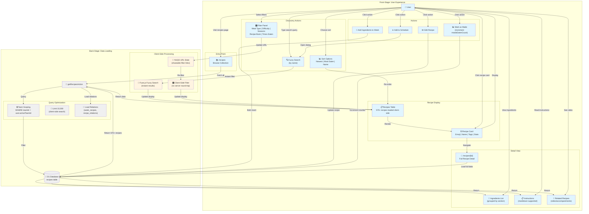

# Recipe Collection Management

**Type:** Feature Diagram
**Last Updated:** 2025-01-09
**Related Files:**
- `src/app/(dashboard)/recipes/page.tsx`
- `src/app/(dashboard)/recipes/[id]/page.tsx`
- `src/app/(dashboard)/recipes/recipes.actions.ts`
- `src/db/schema.ts` (recipes table)

## Purpose

Illustrates how users browse, search, filter, and manage their recipe collection of 570+ recipes. Shows the progression from viewing the collection to finding specific recipes using advanced filters and fuzzy search.

## Diagram

## Key Insights

### User Value
- **Massive collection**: 570+ recipes loaded instantly without pagination lag
- **Instant search**: Fuzzy search with Fuse.js provides results as you type (no loading states)
- **Advanced filtering**: Meal type, difficulty, seasons, recipe book, and times eaten filters
- **Shareable filters**: URL state management means filter combinations can be bookmarked/shared
- **Visual browsing**: Emoji + tags on cards enable quick visual scanning
- **Tracking**: `mealsEatenCount` helps identify favorite recipes over time

### Performance Strategy
- **Client-side search**: Load all 10,000 recipes once, filter on client (faster than server pagination)
- **Server Components**: Initial page render happens on edge with zero client JS
- **Lazy image loading**: Recipe images (if added) use Next.js Image with automatic optimization
- **Debounced search**: Search input debounced to prevent excessive re-renders

### Data Schema
- **Recipes table fields**: id, name, emoji, tags (JSON array), mealType, difficulty, ingredients (JSON), recipeBody (markdown)
- **Tracking fields**: lastMadeDate, mealsEatenCount (updated when marked as made)
- **Relations**: recipeBookId → recipe_books.id, teamId → team.id
- **Visibility**: visibility field (public/private/unlisted) for future multi-tenant sharing

### Filter Combinations
- **Meal Type**: breakfast, lunch, dinner, snack, dessert, appetizer
- **Difficulty**: easy, medium, hard
- **Seasons**: winter, spring, summer, fall (JSON array in tags)
- **Recipe Book**: Filter by source cookbook (470+ books in database)
- **Times Eaten**: Range filter (e.g., 0-5, 5-10, 10+)

### Related Features
- **Recipe Relations**: Self-referencing many-to-many (Recipe → Recipe) for sides/accompaniments
- **Notion Import**: 570+ recipes imported from Notion database via scraper script
- **Team Scoping**: All recipes belong to a team, enabling future family sharing
- **Edit Inline**: Edit ingredients/instructions via dialog without page navigation

## Change History

- **2025-01-09:** Initial recipe management feature diagram showing collection browsing, filtering, and detail view
