# Meal Planning Journey

**Type:** Sequence Diagram
**Last Updated:** 2025-01-09
**Related Files:**
- `src/app/(dashboard)/schedule/page.tsx`
- `src/app/(dashboard)/schedule/[id]/page.tsx`
- `src/app/(dashboard)/schedule/weeks.actions.ts`
- `src/app/(dashboard)/schedule/_components/weeks-board.tsx`

## Purpose

Illustrates the complete user journey for planning weekly meals, from viewing the schedule board to adding recipes and generating grocery lists. Shows how the system helps users transition from "what should I cook this week?" to a fully organized meal plan with shopping list.

## Diagram

```mermaid
sequenceDiagram
    actor User as 👤 User
    participant Browser as 🌐 Browser
    participant SchedulePage as 📅 /schedule Page
    participant WeekDetail as 📋 /schedule/[id] Page
    participant Actions as 🔧 Server Actions
    participant DB as 💾 D1 Database

    Note over User,DB: 🎯 Goal: Plan meals for the week and get grocery list

    User->>Browser: Navigate to /schedule
    Browser->>SchedulePage: Load schedule board

    SchedulePage->>Actions: getWeeksAction()
    Actions->>DB: Query weeks (current, upcoming, archived)
    Note over DB: Team-scoped query: WHERE teamId = user.activeTeamId
    DB-->>Actions: Return weeks with status
    Actions-->>SchedulePage: Weeks grouped by status

    SchedulePage-->>Browser: Render board with 3 columns
    Note over Browser: Current (1) | Upcoming (N) | Archived (N)
    Browser-->>User: Show week cards with recipe counts

    Note over User: 💭 User sees "Current Week" has 3 recipes

    User->>Browser: Click current week card
    Browser->>WeekDetail: Navigate to /schedule/wk_xyz123

    WeekDetail->>Actions: getWeekByIdAction({ id: 'wk_xyz123' })
    Actions->>DB: Query week with recipes + grocery items
    Note over DB: Includes many-to-many relations via week_recipes junction table
    DB-->>Actions: Week + assigned recipes + grocery items
    Actions-->>WeekDetail: Full week data

    WeekDetail-->>Browser: Render 2 sections
    Note over Browser: Section 1: Recipes (with drag-drop)<br/>Section 2: Grocery List (categorized)
    Browser-->>User: Show 3 assigned recipes + grocery list

    Note over User: 💭 User wants to add 2 more dinners

    User->>Browser: Click "Add Recipe" button
    Browser->>User: Open search dialog

    User->>Browser: Search "chicken" filter:dinner
    Note over Browser: Client-side fuzzy search with Fuse.js<br/>⚡ No server round-trip needed
    Browser-->>User: Show matching dinner recipes

    User->>Browser: Select "🍗 Chicken Stir Fry"
    Browser->>Actions: addRecipeToWeekAction({ weekId, recipeId })
    Actions->>DB: INSERT INTO week_recipes (weekId, recipeId, order)
    Note over DB: Auto-increment order for display sequence
    DB-->>Actions: Success
    Actions-->>Browser: Revalidate /schedule/[id]

    Browser->>WeekDetail: Reload page data
    WeekDetail-->>Browser: Show 4 recipes now
    Browser-->>User: Recipe added, list updated

    Note over User: 💭 User opens recipe detail to add ingredients

    User->>Browser: Click "🍗 Chicken Stir Fry"
    Browser->>WeekDetail: Expand inline or navigate to /recipes/rcp_abc
    WeekDetail-->>User: Show ingredients list

    User->>Browser: Click "Add All Ingredients to Week"
    Browser->>Actions: addIngredientsToWeekAction({ weekId, ingredients })
    Actions->>DB: INSERT grocery_items (name, category, weekId)
    Note over DB: Auto-categorize: "chicken" → Meat, "soy sauce" → Pantry
    DB-->>Actions: Items added
    Actions-->>Browser: Revalidate grocery list

    Browser-->>User: Grocery list updated with 8 new items

    Note over User: ✅ Week planned with 4 recipes + full grocery list

    User->>Browser: Mark week as "Current"
    Browser->>Actions: updateWeekStatusAction({ weekId, status: 'current' })
    Actions->>DB: UPDATE weeks SET status = 'current'<br/>WHERE id = weekId AND teamId = user.activeTeamId
    Note over DB: Security: Team-scoped update prevents cross-team modification
    DB-->>Actions: Success
    Actions-->>Browser: Revalidate schedule board

    Browser-->>User: Week moved to "Current" column

    Note over User,DB: 🎉 Impact: 5 minutes to plan entire week with shopping list
```

## Key Insights

### User Value
- **Visual organization**: Board view (Kanban-style) shows current/upcoming/archived weeks at a glance
- **Fast recipe search**: Client-side fuzzy search means instant results without loading states
- **Drag-and-drop ordering**: Recipes can be reordered within the week for visual meal planning
- **Auto-grocery list**: Adding recipe ingredients auto-populates categorized shopping list
- **Status transitions**: Moving weeks between current/upcoming/archived keeps planning organized
- **5-minute planning**: Complete weekly meal plan with grocery list in under 5 minutes

### Performance Optimizations
- **Server Components**: Schedule board and detail pages render on edge, no client JS bundle for data fetching
- **Team-scoped queries**: All database queries filtered by `teamId` to prevent data leakage
- **Revalidation**: After mutations, only affected routes revalidated (not entire app)
- **Client-side search**: Fuse.js fuzzy search on client eliminates server round-trips for recipe filtering

### Data Relationships
- **Many-to-many**: Weeks ↔ Recipes via `week_recipes` junction table with `order` field
- **One-to-many**: Week → Grocery Items with `category` for grouping
- **Self-referencing**: Recipes can have "sides" (Recipe → Recipe relations) shown in detail view

### Error Handling
- **Not found**: Invalid week IDs redirect to 404 via Next.js `notFound()`
- **Team access**: Attempting to access another team's week returns empty result
- **Concurrent edits**: `updateCounter` in database tracks version conflicts

## Change History

- **2025-01-09:** Initial meal planning journey diagram showing board view, recipe assignment, and grocery list generation
