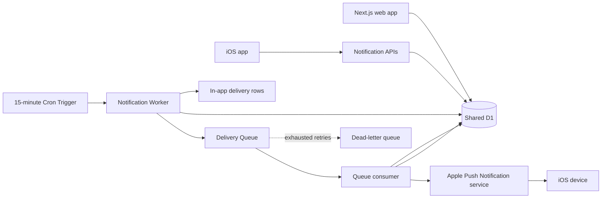

# RFC: Team-scoped multi-channel notifications

- Status: Draft for comment
- Date: 2026-07-19
- Scope: In-app notifications and native iOS push, with room for email, web push, and SMS later
- Product: List To Ladle / Food Tracker

## Summary

Build notifications as a team-scoped product capability, not as provider-specific send calls.

> **Implementation decision — 2026-07-21:** Native iOS push through APNs is the first external channel. SMS is deferred. The event, preference, recipient, queue, suppression, idempotency, and delivery-state model remains channel-neutral; SMS-specific analysis below is retained as future-channel reference rather than launch scope.

The recommended first version has three notification topics:

1. **Daily meal summary** — at a user-selected local time, summarize recipes scheduled for that local calendar day. If there is one recipe, link to that recipe; if there are multiple recipes, link to the week.
2. **Weekly plan summary** — on a user-selected day and time, summarize the relevant current or upcoming plan and link to the week.
3. **Plan published** — when a team member explicitly marks a plan ready, notify opted-in team members once.

Each user chooses topics and channels separately for each team. All meal-planning notifications are off until the user opts in. Native push additionally requires iOS notification permission and an active, installation-scoped APNs token.

The recommended platform shape is:

- the existing D1 database for preferences, in-app inbox records, idempotency, and delivery history;
- a separate Cloudflare Worker for scheduled evaluation, queue consumption, and provider webhooks;
- a Cron Trigger every 15 minutes for timezone-aware due-item evaluation and outbox repair;
- Cloudflare Queues for asynchronous, at-least-once delivery with per-message retry handling and a dead-letter queue;
- APNs token-based authentication for the first external adapter, hidden behind a provider-neutral interface;
- the existing Next.js app and native iOS app for notification preferences and the in-app inbox.

Cloudflare owns scheduling, persistence, fan-out, retries, secrets, and observability, while APNs owns best-effort device delivery. APNs acceptance is not treated as proof of delivery.

## Decision requested

Approve the following direction for an implementation plan:

- Dedicated notification Worker, shared D1, one delivery queue, and one dead-letter queue.
- Daily summary, weekly summary, and explicit plan-published topics in v1.
- In-app and native iOS push in v1; email, web push, and SMS are adapters for later phases.
- APNs token-based authentication for the first external adapter, with credentials held only in Worker secrets.
- Explicit “Publish plan” semantics instead of inferring that a plan is complete.

## Why this fits the current app

The current model already provides the core facts needed for notifications:

- `weeks.teamId` scopes a schedule to a team.
- `weeks.startDate`, `weeks.endDate`, and `weeks.status` identify the relevant planning period.
- `week_recipes.scheduledDate` identifies the recipes for a particular day.
- `team_membership` identifies eligible recipients.
- `/schedule/[id]`, `/recipes/[id]`, and `/recipe/[id]` provide web destinations.
- iOS already has team-scoped local workspaces and models `WeekPlan` and `ScheduledRecipe`.

Two current constraints shape this proposal:

1. A “week” is not guaranteed to contain exactly seven days. It can span an arbitrary start/end range.
2. An empty day is not necessarily incomplete. A household may intentionally cook four times in a seven-day range.

For those reasons, “fully scheduled” is not safely inferable from filled dates. The product should expose a deliberate **Publish plan** or **Mark ready** action. This is distinct from the existing lifecycle values `current`, `upcoming`, and `archived`.

Before any external links are sent, the production canonical URL must be fixed. `SITE_URL` currently resolves to `http://localhost:3000` in both development and production.

## Goals

- Let each team member opt into useful household meal-planning notifications.
- Let a user configure each team independently.
- Let a user choose in-app and native push independently per topic.
- Respect the user's IANA timezone and daylight-saving changes.
- Produce no duplicate in-app notifications and avoid duplicate push alerts wherever technically possible.
- Preserve a durable audit trail of what was generated, suppressed, attempted, delivered, or failed.
- Make new channels additive without rewriting topic generation.
- Keep notification delivery off the schedule mutation request path.
- Support web and iOS from the same server-side notification state.

## Non-goals for v1

- Marketing messages, promotions, or bulk newsletters.
- Chat-style team messaging.
- Per-recipe comments or real-time collaboration.
- WebSockets or live streaming of inbox changes.
- AI-generated notification copy.
- Automatic inference that a week is “complete.”
- Email, SMS, or web push delivery in the first release.
- A general-purpose campaign builder.

## Product model

### Topics

| Topic | Trigger | Default destination | Recommended default | Notes |
| --- | --- | --- | --- | --- |
| Daily meal summary | A due preference and at least one recipe on the user's local date | One recipe: recipe; multiple: week | Off | Send at most once per user/team/local date/channel. Do not send an empty summary. |
| Weekly plan summary | User-selected weekday/time and a relevant current/upcoming week | Week | Off | Include counts and the first few scheduled meals, then a link. |
| Plan published | A team member explicitly publishes or republishes a plan | Week | Off | One notification per publication version. Identify the publishing teammate in-app when available. |

Possible v2 topics include schedule-change digests, grocery reminders, “meal made” activity, and expiring/unplanned-week nudges. They should not be mixed into the initial three topics because their desired frequency and social dynamics are less clear.

### Preference behavior

Preferences are per **user + team + topic + channel**.

Examples:

- Daily summary in-app at 8:00 AM for the household team.
- Daily summary SMS disabled for the household team.
- Weekly summary SMS at 4:00 PM Sunday for the household team.
- Plan-published in-app enabled for a second team, with everything else off.

Recommended rules:

- All meal-planning topics start disabled.
- A user must opt into each channel; enabling in-app does not enable SMS.
- A user selects an IANA timezone such as `America/Boise`, not a fixed UTC offset.
- Daily and weekly time choices use the user's local time.
- Weekly summaries include a configurable weekday.
- Quiet hours are a profile-level v2 feature. In v1, user-chosen delivery times make them less urgent.
- Team owners may make a topic available or unavailable, but may not force a user into SMS.
- Disabling a preference suppresses queued-but-not-yet-sent deliveries when the consumer rechecks it.
- Losing team membership suppresses all unsent team notifications immediately.

### SMS copy rules

SMS content should be deterministic and compact:

- Prefer one GSM-7 segment.
- Do not include recipe emoji in SMS; a Unicode character can substantially reduce characters per segment.
- Put the useful fact before the link.
- Truncate long recipe lists and end with “+ N more.”
- Use an app-owned short redirect such as `/n/{opaqueId}` rather than paying for provider-specific link shortening or exposing internal tokens.
- Never place private recipe content in the SMS body. The authenticated destination performs authorization.
- Include the required opt-out language in the initial confirmation and as required by the selected provider and jurisdiction.

Examples:

> Tonight: Rigatoni with tomato cream sauce. View recipe: https://example.com/n/abc123

> This week: 5 meals planned. Mon Rigatoni; Wed Burrito bowls; Fri Curry; +2 more. View plan: https://example.com/n/def456

## Recommended architecture



### Why a separate Worker

The deployed Next.js worker's entrypoint is generated by OpenNext. A separate `apps/notifications` Worker keeps `scheduled()`, `queue()`, and provider webhook concerns outside the generated web entrypoint. It can bind to the same D1 database and be deployed independently.

The web app remains responsible for authenticated product APIs and schedule actions. The notification Worker remains responsible for time evaluation and external delivery.

If the web app later needs to request immediate dispatch, a Service Binding can call the notification Worker without a public URL or extra service-binding request fee on Workers Standard. The initial design does not require that coupling because D1 acts as the durable handoff.

### Why Cron Trigger + Queues

Cron Triggers run in UTC, so one fixed local-time cron per user is not workable. Run one evaluator every 15 minutes and query indexed `nextDueAt` values. For each due preference:

1. Calculate the user's local date/time from their IANA timezone.
2. Load the relevant team schedule.
3. Create a logical event and recipient snapshot with deterministic dedupe keys.
4. Create the in-app inbox record if enabled.
5. Create an external delivery row and enqueue only its ID if iOS push is enabled.
6. Advance `nextDueAt` to the next valid local occurrence.

Queues provide at-least-once delivery, configurable batches, per-message retries/delays, and dead-letter queues. At-least-once means duplicates are possible, so D1 unique constraints and delivery state—not the queue message ID—are the source of idempotency.

### Why not Workflows in v1

Cloudflare Workflows is a good fit for long-running, multi-step processes that sleep, wait for events, or require independently retried steps. It now supports schedules directly on Workflow bindings.

The proposed notifications are short evaluation-and-delivery jobs. Cron + Queues is simpler, easier to replay, and sufficient. Workflows also begins charging Workers Paid customers for step and storage usage no earlier than August 10, 2026. Revisit Workflows if a later feature needs multi-day escalation, approval, provider fallback, or complex wait/resume behavior.

### Why not Durable Objects in v1

No per-user singleton, live connection, or strongly coordinated real-time state is required. D1 unique constraints handle deduplication and Queues handle asynchronous work. Durable Objects may become useful for real-time inbox streaming or high-contention rate coordination, but they would add an unnecessary state system today. The existing `NEXT_CACHE_DO_QUEUE` Durable Object is an OpenNext cache concern and should not be reused for product notifications.

### Why not KV as the source of truth

Preferences, unread state, membership-sensitive queries, delivery history, and dedupe keys are relational data. D1 fits these access patterns and is already the app's team data store. KV can cache non-authoritative configuration, but should not own consent or delivery state.

## Cloudflare ecosystem evaluation

| Capability | Fit | Recommendation |
| --- | --- | --- |
| Workers | Excellent | Run the separate notification evaluator, queue consumer, webhook receiver, and health endpoint. |
| Cron Triggers | Excellent | Run every 15 minutes in UTC; calculate local due times in code. Make every run idempotent. |
| D1 | Excellent | Store preferences, contact/consent state, events, inbox records, delivery attempts, and short-link targets. Add indexes matching due and inbox queries. |
| Queues | Excellent | Buffer SMS work, retry transient failures, cap concurrency, and isolate exhausted failures in a DLQ. Use per-message acknowledgement. |
| Workflows | Later | Use only if notifications become long-running orchestrations with sleeps, external events, or multi-provider fallback. |
| Durable Objects | Not needed now | Reconsider for live fan-out or strict per-recipient coordination at much higher scale. |
| KV | Cache only | Do not store preferences, consent, or unread state in eventually consistent KV. |
| Email Service | Optional later | Cloudflare Email Sending is a transactional-email beta on Workers Paid. The app already has Resend/Brevo integrations, so do not migrate authentication mail as part of this feature. |
| Analytics Engine | Optional later | Structured Worker logs plus D1 delivery state are enough initially. Add Analytics Engine for high-cardinality operational metrics if volume warrants it. |
| Secrets / Worker secrets | Good | Store SMS credentials and encryption/HMAC keys outside source. A shared Secrets Store can be considered if several Workers need the same credential. |
| Service Bindings | Good later | Useful for private web-to-notification RPC, but not needed for the durable D1 outbox path. |

## Deferred SMS provider evaluation

This section is retained for a possible later SMS adapter and is not part of the current launch path.

Cloudflare will make ordinary HTTPS API calls to the provider. Keep the adapter boundary small:

```ts
interface SmsProvider {
  send(input: {
    deliveryId: string;
    toE164: string;
    body: string;
    statusCallbackUrl: string;
  }): Promise<{ providerMessageId: string; acceptedAt: Date }>;
}
```

| Provider | Strengths | Tradeoffs | RFC position |
| --- | --- | --- | --- |
| Twilio Messaging Services | Mature delivery callbacks, sender pools, Advanced Opt-Out, Consent API, extensive compliance tooling | Higher base US SMS cost; carrier, number, and registration fees still apply | Recommended first adapter because operational and consent tooling matter more than a fraction of a cent at expected household volume. |
| Telnyx Messaging Profiles | Lower listed base US price, smart encoding, spend limits, primary/failover webhooks, delivery events | Smaller ecosystem and a little more application-owned consent workflow | Strong alternative if projected message volume makes unit price material. |

As of this RFC, Twilio lists US outbound SMS at $0.0083 per segment before carrier fees, while Telnyx lists local/10DLC outbound SMS at $0.004 per message part before carrier fees. Prices change and must be refreshed before implementation. US application-to-person messaging also requires sender registration or verification; this operational lead time is more likely to delay launch than Cloudflare implementation.

For a small household product, SMS will dominate marginal cost. D1, Worker, and Queue usage should remain within included usage at early scale if due-time and inbox indexes prevent table scans.

## Proposed data model

Names are illustrative. The implementation should use the project's normal Drizzle schema and generated migration workflow.

### `notification_preferences`

One row per user/team/topic/channel.

| Column | Purpose |
| --- | --- |
| `id` | Generated application ID. |
| `teamId` | Team owning the subscription context. |
| `userId` | Recipient. |
| `topic` | `daily_schedule`, `weekly_summary`, or `week_published`. |
| `channel` | `in_app` or `sms`; extensible to `email`, `ios_push`, and `web_push`. |
| `enabled` | Explicit opt-in state. |
| `timezone` | IANA timezone, for example `America/Boise`. |
| `localTime` | `HH:mm` for daily/weekly topics. |
| `dayOfWeek` | Nullable ISO weekday for weekly summaries. |
| `nextDueAt` | Precomputed UTC timestamp used by the scheduler. |
| `createdAt`, `updatedAt` | Audit fields. |

Constraints and indexes:

- Unique `(teamId, userId, topic, channel)`.
- Index `(enabled, nextDueAt)` for the scheduler.
- Index `(userId, teamId)` for the settings page.

### `notification_contacts`

External channel addresses and consent are user-scoped rather than team-scoped.

| Column | Purpose |
| --- | --- |
| `userId`, `channel` | Unique owner/channel pair. |
| `addressCiphertext` | Application-encrypted E.164 number. |
| `addressLookupHash` | Keyed hash for inbound STOP and callback lookup without plaintext indexing. |
| `displayAddress` | Masked form such as `(***) ***-1234`. |
| `verifiedAt` | Successful possession verification. |
| `consentedAt`, `consentSource`, `consentTextVersion` | Evidence of explicit opt-in. |
| `optedOutAt`, `optOutSource` | App or carrier/provider opt-out. |
| `createdAt`, `updatedAt` | Audit fields. |

Never log plaintext phone numbers. Encryption and lookup-HMAC keys belong in Worker secrets.

### `notification_events`

A logical product event shared by all recipients/channels.

| Column | Purpose |
| --- | --- |
| `id` | Event ID. |
| `teamId` | Team scope. |
| `topic` | Topic key. |
| `entityType`, `entityId` | Usually `week` and the week ID. |
| `actorUserId` | Nullable publishing teammate. |
| `scheduledFor` | Logical occurrence time. |
| `payload` | Small versioned snapshot used to render/audit the message. |
| `dedupeKey` | Unique logical occurrence key. |
| `createdAt` | Audit field. |

Examples:

- `daily_schedule:{teamId}:{userId}:{localDate}`
- `weekly_summary:{teamId}:{userId}:{periodStart}`
- `week_published:{weekId}:{publicationVersion}`

### `notification_recipients`

The user-visible inbox item.

| Column | Purpose |
| --- | --- |
| `eventId`, `teamId`, `userId` | Event and recipient scope. |
| `title`, `body`, `href` | Rendered in-app content and destination. |
| `readAt`, `archivedAt` | Inbox state. |
| `createdAt` | Sort key. |

Constraints and indexes:

- Unique `(eventId, userId)`.
- Index `(userId, teamId, createdAt DESC)`.
- Index `(userId, teamId, readAt, createdAt DESC)` for unread counts.

### `notification_deliveries`

One external or internal delivery attempt stream per recipient/channel.

| Column | Purpose |
| --- | --- |
| `recipientId`, `channel` | Delivery target. |
| `status` | `pending`, `queued`, `sending`, `accepted`, `delivered`, `suppressed`, `failed`, or `unknown`. |
| `provider` | `in_app`, `twilio`, or a future adapter. |
| `providerMessageId` | Provider correlation ID. |
| `dedupeKey` | Unique event/user/channel key. |
| `attemptCount`, `lastAttemptAt`, `nextAttemptAt` | Retry state. |
| `acceptedAt`, `deliveredAt`, `failedAt` | Delivery lifecycle. |
| `errorCode`, `errorDetail` | Sanitized failure information. |
| `createdAt`, `updatedAt` | Audit fields. |

Constraints and indexes:

- Unique `dedupeKey`.
- Unique `(provider, providerMessageId)` when a provider ID exists.
- Index `(status, nextAttemptAt)` for repair work.

### `notification_links`

Optional short-link mapping.

| Column | Purpose |
| --- | --- |
| `id` | Opaque, unguessable short ID. |
| `recipientId` | Recipient context for authorization and metrics. |
| `targetPath` | Relative app path only. |
| `expiresAt` | Retention bound. |
| `openedAt` | Optional first-open metric. |

The redirect must authenticate the user, verify current team membership and target access, and then navigate. It must not become a bearer-token bypass for private recipes.

## Delivery flows

### Daily and weekly scheduled flow

1. Cron invokes the evaluator every 15 minutes.
2. The evaluator selects enabled preference rows with `nextDueAt <= now`, using a bounded page.
3. It rechecks active team membership.
4. It calculates the relevant local date/period and queries the current schedule.
5. Empty daily summaries are suppressed and recorded without sending.
6. Deterministic event, recipient, and delivery keys are inserted with conflict-ignore behavior.
7. In-app rows become immediately visible.
8. SMS delivery IDs are sent to the Queue.
9. `nextDueAt` advances from the intended local occurrence, not from the actual run time, preventing drift.
10. A later run repairs any `pending` delivery that was persisted but not queued.

The due query must be paginated and indexed. A single cron run should have an explicit maximum, log the remaining count, and let the next invocation continue rather than attempting an unbounded account-wide scan.

### Plan-published flow

1. A permitted team member selects **Publish plan**.
2. The week receives `publishedAt`, `publishedByUserId`, and a monotonically increasing `publicationVersion` (or an equivalent explicit publication record).
3. The domain service upserts `week_published:{weekId}:{publicationVersion}` into `notification_events`.
4. The notification evaluator fans the event out to active members with enabled preferences.
5. Publishing again creates a new version and may notify again; editing a published week does not silently notify everyone.

Because the app supports both web writes and offline mobile sync, event creation must not live only in a web component action. The publication mutation should share one server-side domain path, and a reconciliation query should be able to recreate a missing event from publication state.

### Queue consumer flow

For every message independently:

1. Load the delivery row by ID.
2. Recheck membership, enabled preference, verified contact, consent, global SMS kill switch, and current opt-out state.
3. Atomically claim a short `sending` lease if the delivery is still eligible.
4. Render deterministic SMS content from the stored event snapshot.
5. Call the provider with a timeout.
6. Store the provider message ID and mark `accepted`.
7. Acknowledge the queue message.

On errors:

- Retry `429`, timeouts, and provider `5xx` responses with bounded exponential delay.
- Mark validation, consent, membership, and most provider `4xx` failures as permanent; acknowledge without retrying.
- Handle every queue message in its own `try/catch`. An uncaught error can cause the whole batch to be retried.
- Route exhausted transient failures to the DLQ and alert an operator.

There is an unavoidable ambiguity if a provider accepts an SMS but the Worker fails before persisting the provider ID. Notifications should bias toward **not sending a possible duplicate**: keep an uncertain send as `unknown`, wait for the provider callback, and require reconciliation/manual replay instead of blindly resending.

### Provider callbacks and inbound opt-out

The notification Worker exposes narrow public webhook routes:

- delivery status callback;
- inbound SMS/opt-out callback.

Requirements:

- Verify the provider signature before parsing or mutating state.
- Make callbacks idempotent by provider event/message ID.
- Permit out-of-order statuses and only move to a valid later state.
- On STOP or provider opt-out, immediately set `optedOutAt`, disable all SMS preferences for that contact, and retain the consent/opt-out audit record.
- Do not rely only on the application's preference toggle; carrier/provider opt-out is authoritative.
- Return a fast success response and queue heavier processing if needed.

## In-app experience

### Web

- Add a bell to the authenticated shell with an unread count for the active team.
- Add `/notifications` for a paginated inbox.
- Add `/settings/notifications` with a team selector and topic/channel matrix.
- Group inbox items by recency and show topic, team, summary, time, read state, and destination.
- Support mark read, mark all read for this team, and archive.
- Do not display notifications for a team the user can no longer access.

### iOS

- Add the same notification center and preference surface after the web behavior is accepted.
- Use dedicated notification endpoints rather than treating server-originated inbox rows as ordinary offline-editable workspace entities.
- Cache recent inbox rows for fast launch, refresh on foreground/team switch, and queue only user-authored read/archive mutations if offline behavior is needed.
- Add universal-link routing in the push phase. Until then, SMS links safely open the authenticated web route.

### Team context and links

The current app has an active-team session, but a notification may refer to another team. A notification link should resolve team membership first and switch or establish the correct team context before rendering. Long-term canonical routes should carry enough team context to avoid showing the destination under the wrong team shell.

For daily summaries:

- one scheduled recipe: link to the authenticated recipe route;
- more than one: link to the week;
- private/unlisted recipes: never use the public recipe route as an authorization bypass.

## API surface

Illustrative authenticated endpoints:

- `GET /api/notifications?teamId=&cursor=`
- `GET /api/notifications/unread-count?teamId=`
- `POST /api/notifications/{id}/read`
- `POST /api/notifications/read-all`
- `GET /api/notifications/preferences?teamId=`
- `PATCH /api/notifications/preferences`
- `POST /api/notifications/sms/verification/start`
- `POST /api/notifications/sms/verification/confirm`
- `DELETE /api/notifications/sms/contact`
- `GET /n/{opaqueId}`

External endpoints on the notification Worker:

- `POST /webhooks/twilio/status`
- `POST /webhooks/twilio/inbound`
- `GET /health`

Every authenticated read/write is scoped by current membership, not by a client-supplied team ID alone.

## Reliability and idempotency

### Required invariants

- One in-app inbox item per logical event and user.
- At most one intended external delivery per logical event, user, and channel.
- A disabled preference, inactive membership, unverified contact, or SMS opt-out always suppresses a not-yet-sent delivery.
- Retries never regenerate message copy from mutable live data after an event snapshot has been accepted.
- Scheduler downtime does not cause unlimited stale notifications to arrive later.

### Staleness policy

- Daily summary: do not send if more than two hours late.
- Weekly summary: do not send if more than 24 hours late.
- Plan published: deliver while the publication is still current, up to 24 hours.

Store the suppression reason (`stale`, `empty`, `membership`, `preference`, `unverified`, `opted_out`, `kill_switch`) for product and operational analysis.

### Cleanup and retention

Initial recommendation:

- Inbox items: 90 days, with user archive support.
- Successful delivery detail: 90 days.
- Sanitized failure detail: 30 days after resolution.
- Short links: 90 days or the parent notification retention, whichever comes first.
- Consent and opt-out audit: retain according to the eventual legal/compliance policy; do not apply the general 90-day cleanup blindly.

## Security, privacy, and compliance

- SMS is opt-in only. Record the exact consent copy version, timestamp, and source.
- Verify phone possession before enabling SMS.
- Support STOP/START/HELP behavior through the provider and mirror provider opt-outs locally.
- Recheck active team membership at generation, delivery, inbox read, and link resolution.
- Encrypt phone numbers at the application layer and store a keyed lookup hash for callbacks.
- Keep provider keys, encryption keys, and webhook-verification secrets in Worker secrets, not plain `vars`.
- Avoid phone numbers, message bodies, recipe names, and provider payloads in general logs.
- Rate-limit verification, preference, redirect, and webhook endpoints as appropriate.
- Use signed provider callbacks and replay protection.
- Provide deletion/export behavior for notification preferences, contacts, and inbox data.
- Treat legal requirements as a launch gate. Provider tooling helps, but does not replace review of TCPA, carrier rules, and applicable regional privacy/anti-spam laws.

## Observability and operations

### Metrics

- Scheduler heartbeat and duration.
- Due preferences evaluated.
- Events generated, deduplicated, and suppressed by reason.
- Deliveries queued, accepted, delivered, failed, unknown, and DLQ'd by topic/channel/provider.
- Provider latency and callback latency.
- SMS segments per message.
- Opt-in, opt-out, and verification completion rates.
- Unread count and notification-open rate without logging message content.

Start with structured Worker logs and D1 delivery state. Add Analytics Engine when querying high-cardinality operational data in D1 becomes inefficient.

### Alerts and controls

- Alert if the scheduler heartbeat is missing for 30 minutes.
- Alert on any DLQ accumulation in early rollout.
- Alert on a sustained provider failure rate above an agreed threshold.
- Add `NOTIFICATIONS_ENABLED` and per-channel kill switches.
- Configure provider spend limits where available.
- Provide an operator-only replay command that requires an explicit delivery ID set; never replay an entire DLQ blindly.
- Expose a health endpoint that checks configuration and recent scheduler state without sending a test SMS.

## Cost expectations

At early household scale, SMS provider charges and registration/number fees dominate.

Example: ten opted-in recipients receiving one daily SMS and one weekly SMS generate roughly 340 outbound segments per 30-day month before retries. At current listed base prices, that is about $2.82 at Twilio or $1.36 at Telnyx, before carrier, phone-number, registration, and optional feature fees.

Cloudflare usage is small by comparison:

- D1 on Workers Paid currently includes 25 billion rows read and 50 million rows written per month, so indexed early-scale notification queries should fit comfortably.
- Queues charge by 64 KB operations and include the first one million operations per month; a normal successful sub-64 KB message uses write, read, and delete operations.
- Workers Paid starts at $5/month and includes 10 million requests plus CPU allowances.

These are planning figures, not a quote. Refresh provider and Cloudflare pricing immediately before implementation.

## Rollout plan

### Phase 0: Product and compliance decisions

- Resolve the open questions below.
- Fix the canonical production URL.
- Choose the SMS provider and sender type.
- Complete required sender registration/verification.
- Approve consent copy, privacy policy changes, retention, and opt-out behavior.

### Phase 1: In-app foundation

- Add the data model and migration.
- Add topic definitions, preference APIs, and web settings UI.
- Add the explicit plan-published domain behavior.
- Add scheduler evaluation in local development without external delivery.
- Add the web inbox, unread count, read/archive actions, and authorization tests.
- Add structured delivery/suppression logging.

This phase proves event semantics and preference granularity without carrier risk.

### Phase 2: Native push adapter

- Deploy the notification Worker, Queue, and DLQ.
- Add authenticated, installation-scoped APNs device-token registration.
- Implement APNs ES256 provider authentication, invalid-token suppression, and kill switches.
- Start with one internal team and explicitly authorized devices.
- Run duplicate, retry, stale-event, permission-revocation, removed-member, and provider-outage drills.

### Phase 3: Native parity

- Add notification preferences and inbox to iOS after the web behavior is accepted.
- Add dedicated notification fetch/read APIs and cached inbox behavior.
- Verify team switching and notification link destinations visibly in the simulator.

### Phase 4: Optional email, web push, and SMS

- Add universal links and notification routing in iOS.
- Consider web push with a service worker and VAPID.
- Consider transactional email using the existing Resend/Brevo abstraction or Cloudflare Email Sending after its beta status and economics are reassessed.
- Reassess SMS only if users need delivery outside the native app and its compliance/registration cost is justified.

The event, recipient, preference, and delivery model remains unchanged; each addition is a channel adapter plus contact/device registration.

## Test strategy

### Domain tests

- Due-time calculation across DST spring-forward and fall-back.
- Arbitrary week ranges and intentionally empty days.
- One-recipe versus multi-recipe destinations.
- Current/upcoming week selection and overlapping/missing schedule data.
- Republish versions and dedupe keys.
- Membership removal and team switching.
- Empty and stale suppression.

### Queue and provider tests

- Duplicate queue delivery.
- One failed item in a batch does not retry successful siblings.
- `429`, timeout, `5xx`, permanent `4xx`, and malformed payload classification.
- Crash/uncertain-send handling.
- DLQ routing and explicit replay.
- APNs acceptance and invalid-token response classification.
- Permission and device-registration revocation.
- Global and push-only kill switches.

### End-to-end acceptance

- A user can opt into one topic/channel for one team without changing another team.
- A daily in-app item appears once at the expected local time and opens the correct destination.
- A push alert arrives once, contains the expected compact summary, and opens an authorized destination.
- A removed teammate receives neither queued push nor inbox access.
- A published plan notifies opted-in members once; ordinary edits do not create surprise push alerts.
- The iOS inbox reflects the same server state after the native parity phase.

## Alternatives considered

### Send directly from schedule actions

Rejected. It increases user-facing latency, cannot reliably cover offline mobile mutations, couples every mutation path to channel code, and makes retry behavior fragile.

### One Workflow per user preference

Rejected for v1. Long-lived per-preference workflows complicate preference edits, timezone changes, and cancellation. A due-time index plus a periodic evaluator is easier to inspect and repair.

### One cron expression per timezone or user

Rejected. Cron is UTC-only, daylight-saving changes make fixed conversions wrong, and per-user schedules do not scale operationally.

### Infer “fully scheduled” from dates

Rejected. Week ranges are arbitrary and empty days may be intentional. Explicit publication communicates human intent.

### Store preferences in KV

Rejected. Consent, team membership, due-time queries, unread state, and delivery audit need relational querying and durable constraints.

### Twilio-only data model

Rejected. Provider identifiers belong on delivery/contact records, not in topic generation or user preferences. A narrow adapter preserves vendor choice.

## Open questions for comment

The RFC recommends an answer in parentheses.

1. Should daily summaries describe all meals scheduled that day, or dinner only? (**All scheduled recipes; use meal type labels when present.**)
2. What default time should the picker suggest? (**8:00 AM local for daily; Sunday 4:00 PM local for weekly. Both remain off until enabled.**)
3. Should a one-recipe daily push link directly to the recipe? (**Yes; multiple recipes link to the week.**)
4. What does publishing mean after later edits? (**Edits do not notify. A teammate explicitly republishes to create a new notification version.**)
5. Should the notification center show only the active team or all teams? (**Active team by default, with an all-teams filter on the full inbox.**)
6. Should team owners be able to disable a topic for the whole team? (**Yes, but they can never force-enable an external channel.**)
7. Should SMS remain in the launch scope? (**No. Keep the adapter model portable and revisit only if native push is insufficient.**)
8. Should in-app notifications be on by default? (**No for these meal-planning topics, matching the requested opt-in model.**)
9. How long should inbox and successful delivery history remain visible? (**90 days initially.**)
10. Should native push launch before SMS? (**Yes. Validate the provider-neutral model with the two household iOS users first.**)

## Sources

Cloudflare:

- [Cron Triggers](https://developers.cloudflare.com/workers/configuration/cron-triggers/) — UTC schedules, `scheduled()` handlers, and propagation behavior.
- [Queues delivery guarantees](https://developers.cloudflare.com/queues/reference/delivery-guarantees/) — at-least-once delivery and idempotency guidance.
- [Queues batching, retries, and delays](https://developers.cloudflare.com/queues/configuration/batching-retries/) — per-message acknowledgement, retry, delay, and batch behavior.
- [Queues dead-letter queues](https://developers.cloudflare.com/queues/configuration/dead-letter-queues/) — exhausted failure handling.
- [Queues limits](https://developers.cloudflare.com/queues/platform/limits/) and [pricing](https://developers.cloudflare.com/queues/platform/pricing/).
- [D1 index guidance](https://developers.cloudflare.com/d1/best-practices/use-indexes/) and [D1 pricing](https://developers.cloudflare.com/d1/platform/pricing/).
- [Service Bindings](https://developers.cloudflare.com/workers/runtime-apis/bindings/service-bindings/) — private Worker-to-Worker calls.
- [Workflows overview](https://developers.cloudflare.com/workflows/), [scheduled Workflow triggers](https://developers.cloudflare.com/workflows/build/trigger-workflows/), [limits](https://developers.cloudflare.com/workflows/reference/limits/), and [pricing](https://developers.cloudflare.com/workflows/reference/pricing/).
- [Cloudflare Email Service](https://developers.cloudflare.com/email-service/) — optional transactional email channel.
- [Workers pricing](https://developers.cloudflare.com/workers/platform/pricing/).

SMS and future push:

- [Twilio Messaging Services](https://www.twilio.com/docs/messaging/services), [Consent Management API](https://www.twilio.com/docs/messaging/features/consent-api), [Messaging Policy](https://www.twilio.com/en-us/legal/messaging-policy), and [US SMS pricing](https://www.twilio.com/en-us/sms/pricing/us).
- [Telnyx Messaging Profiles](https://developers.telnyx.com/docs/messaging/messages/messaging-profiles-overview), [delivery lifecycle](https://developers.telnyx.com/docs/messaging/messages/send-message), and [messaging pricing](https://telnyx.com/pricing/messaging).
- [Apple remote notification server](https://developer.apple.com/documentation/usernotifications/setting-up-a-remote-notification-server) and [token-based APNs authentication](https://developer.apple.com/documentation/usernotifications/establishing-a-token-based-connection-to-apns).
- [MDN Push API](https://developer.mozilla.org/en-US/docs/Web/API/Push_API) for a possible web-push adapter.
